# NIS (Network Information Service) — Installation & Configuration Guide
## Rocky Linux 8.10

---

## Table of Contents
1. [Introduction to NIS](#introduction)
2. [NIS Server Installation & Configuration](#server)
3. [NIS Client Installation & Configuration](#client)
4. [Final Verification & Testing](#verification)
5. [Key Commands Reference](#reference)

---

## 1. Introduction to NIS {#introduction}

NIS (Network Information Service), originally called **Yellow Pages (YP)**, is a client-server directory service protocol developed by Sun Microsystems. It allows a group of machines on a network to share configuration files such as **users, passwords, groups, and hostnames** from a central server.

### Why Use NIS?
- ✅ Centralized user account management across multiple Linux machines
- ✅ Users can log in to any NIS client using the same credentials
- ✅ Eliminates the need to manually create accounts on every machine
- ✅ Easy to manage in lab, development, and small enterprise environments

### Lab Environment

| Role | Hostname | IP Address |
|------|----------|------------|
| NIS Server | `labtesting.local` | `192.168.245.132` |
| NIS Client | `labtesing-client.local` | Same subnet |
| NIS Domain | `labtesting.local` | Rocky Linux 8.10 |

---

## 2. NIS Server Installation & Configuration {#server}

### Step 1 — Verify Repositories

Before installing NIS packages, verify that the required repositories are enabled. The `ypserv` package comes from the **AppStream** repository.

```bash
dnf repolist
```

> **What this does:** Lists all enabled DNF repositories. You should see `appstream`, `baseos`, `epel`, `extras`, and `powertools`.

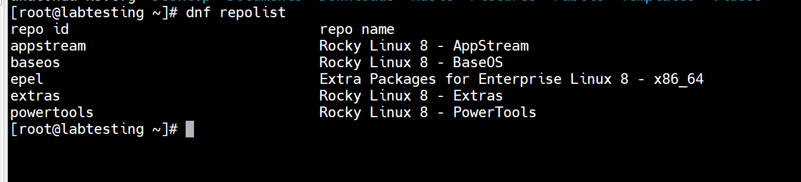
*Figure 1: Enabled repositories on Rocky Linux 8.10*

---

### Step 2 — Install NIS Server Packages

Install the core NIS server packages: `ypserv` (the NIS server daemon) and `rpcbind` (the RPC port mapper that NIS depends on).

```bash
dnf install -y ypserv rpcbind
```

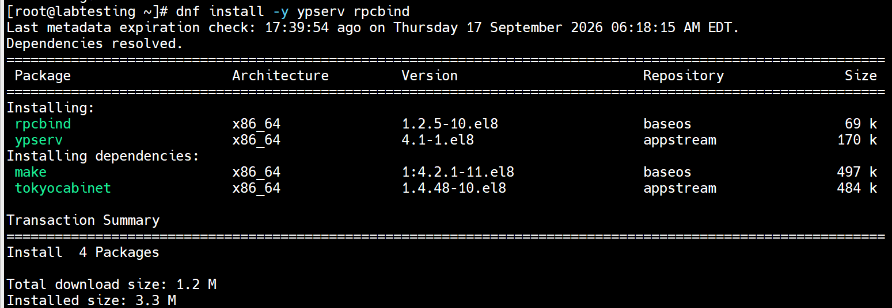
*Figure 2: Installing ypserv and rpcbind — 4 packages installed (1.2 MB)*

---

### Step 3 — Set the NIS Domain Name

The NIS domain name groups the server and all its clients together. Every machine in the NIS environment must use the **exact same domain name**.

```bash
nisdomainname labtesting.local
```

> **What this does:** Sets the NIS domain name to `labtesting.local` for the current session. Takes effect immediately but is **not persistent** across reboots.


*Figure 3: Setting NIS domain name to labtesting.local*

To make the domain name **persistent across reboots**:

```bash
echo "NISDOMAIN=labtesting.local" >> /etc/sysconfig/network
cat /etc/sysconfig/network
```

> **What this does:** The `>>` operator appends to the file without overwriting it. The `cat` command verifies the change was written correctly.

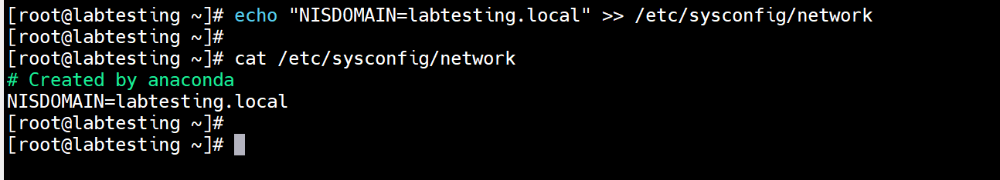
*Figure 4: Making NIS domain name persistent in /etc/sysconfig/network*

Verify the domain name is correctly set:

```bash
nisdomainname
```


*Figure 5: Verifying NIS domain name — labtesting.local confirmed*

---

### Step 4 — Configure /etc/ypserv.conf

The `ypserv.conf` file controls NIS server behavior including **access control** and security settings.

```bash
vi /etc/ypserv.conf
```

Add this line at the bottom to restrict NIS access to your local subnet only:

```
192.168.1.0/24 : * : * : none
```

> **What this does:** Format is `[Host/Network] : [Domain] : [Map] : [Security]`. This means hosts in `192.168.1.0/24` can access all (`*`) NIS domains and all (`*`) maps. `none` means no additional port security. Shadow passwords remain protected (those lines stay commented out).

> 💡 **Security Note:** Keeping shadow password lines commented out protects encrypted passwords from being exposed to NIS clients — a critical security practice.

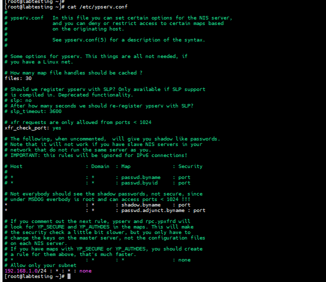
*Figure 6: /etc/ypserv.conf — subnet restriction configured*

---

### Step 5 — Enable & Start NIS Services

NIS requires **four services** running on the server. Start `rpcbind` first as it is a dependency for all others.

```bash
# 1. RPC port mapper — prerequisite for all NIS services
systemctl enable --now rpcbind

# 2. Main NIS server daemon
systemctl enable --now ypserv

# 3. Password change service — allows clients to change passwords
systemctl enable --now yppasswdd.service

# 4. Map transfer accelerator — speeds up map transfers
systemctl enable --now ypxfrd.service
```

> **What `--now` does:** The `--now` flag with `systemctl enable` both **enables** the service (starts on boot) AND **starts it immediately** — no need for a separate `systemctl start` command.


*Figure 7: rpcbind enabled and started*

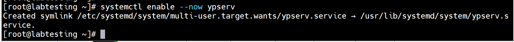
*Figure 8: ypserv enabled — symlink created in systemd*

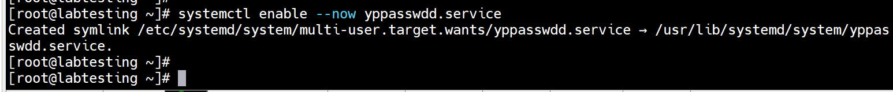
*Figure 9: yppasswdd enabled — password change service active*

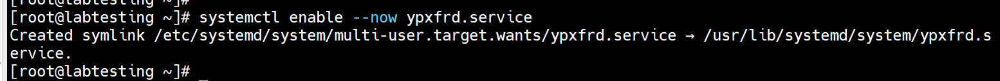
*Figure 10: ypxfrd enabled — map transfer accelerator active*

---

### Step 6 — Verify All Services Are Running

```bash
systemctl status rpcbind.service
systemctl status ypserv.service
systemctl status yppasswdd.service
systemctl status ypxfrd.service
```

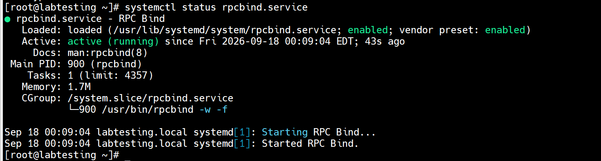
*Figure 11: rpcbind.service — Active (running) since Sep 18 2026*

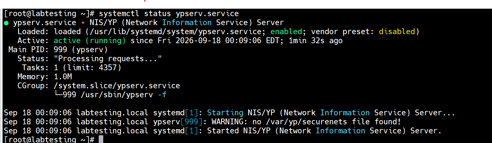
*Figure 12: ypserv.service — Active (running), Processing requests...*

> 💡 **Note:** The WARNING `no /var/yp/securenets file found` is **harmless** — it means access control is managed via `ypserv.conf` instead of the `securenets` file, which is our chosen approach.

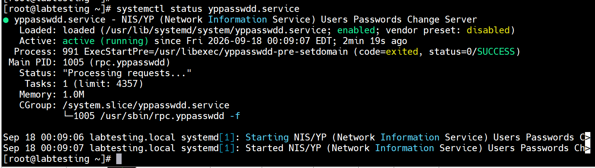
*Figure 13: yppasswdd.service — Active (running)*

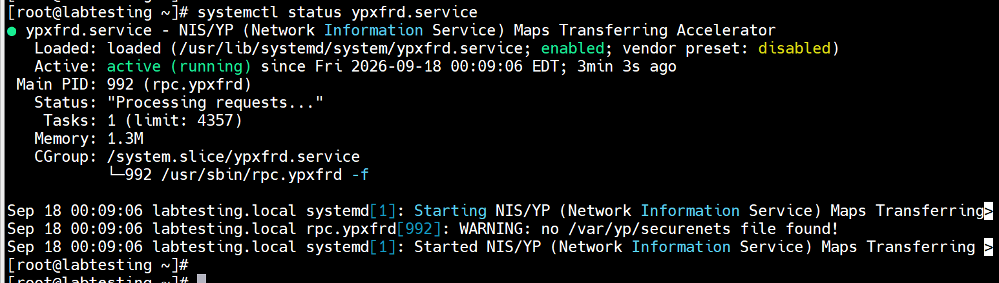
*Figure 14: ypxfrd.service — Active (running)*

---

### Step 7 — Initialize the NIS Database (ypinit)

The `ypinit` command builds the initial NIS database (maps) from the system files. The `-m` flag designates this machine as the **NIS master server**.

```bash
/usr/lib64/yp/ypinit -m
```

> **What this does:** Prompts you to enter the list of NIS servers. Type your server hostname, press Enter, then press `Ctrl+D` when done. Type `y` to confirm. Then builds all NIS maps under `/var/yp/labtesting.local/`.

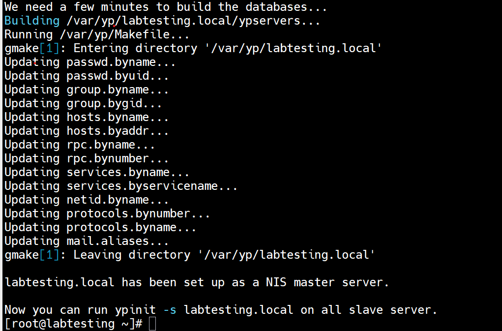
*Figure 15: ypinit -m — Designating labtesting.local as NIS master server*

---

### Step 8 — Verify RPC Services

```bash
rpcinfo -p localhost
```

> **What this does:** Lists all RPC programs registered with the port mapper. You should see `portmapper` (111), `ypserv` (751), `yppasswdd` (757), and `fypxfrd` (744).

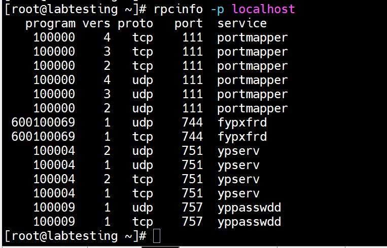

---

## 3. NIS Client Installation & Configuration {#client}

### Step 1 — Install NIS Client Packages

On the **client machine**, install the required packages:

```bash
dnf install -y ypbind rpcbind oddjob-mkhomedir
```

> **What this does:** Installs `ypbind` (NIS client daemon), `rpcbind`, and `oddjob-mkhomedir` (auto-creates home directories on first login). Also installs dependencies: `nss_nis` (NSS plugin), `oddjob`, and `yp-tools` (ypcat, ypwhich, ypmatch).

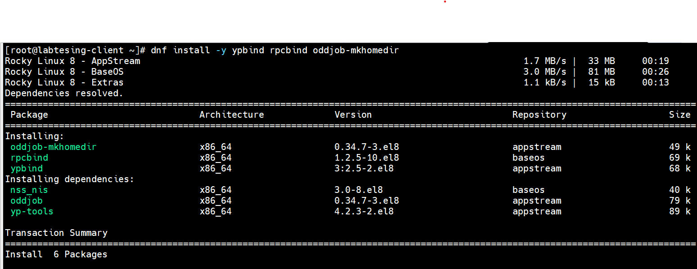


---

### Step 2 — Set NIS Domain Name on Client

The domain name on the client **MUST exactly match** the server.

```bash
nisdomainname labtesting.local
echo "NISDOMAIN=labtesting.local" >> /etc/sysconfig/network
nisdomainname
```

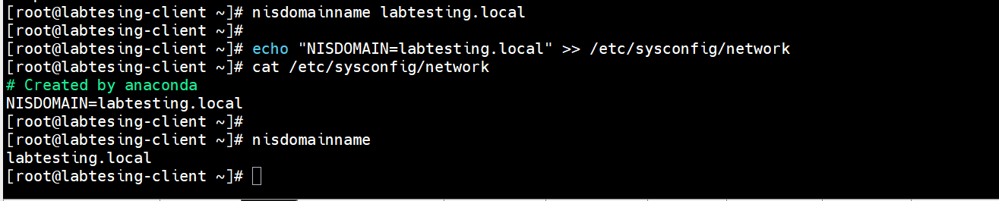


---

### Step 3 — Configure /etc/yp.conf

The `yp.conf` file tells the NIS client **which server to connect to**.

```bash
vi /etc/yp.conf
```

Add this line:

```
domain labtesting.local server 192.168.245.132
```

> **What this does:** Tells `ypbind`: "For the domain `labtesting.local`, contact the server at `192.168.245.132`." Using the IP address is more reliable than a hostname in case DNS is not yet resolving.

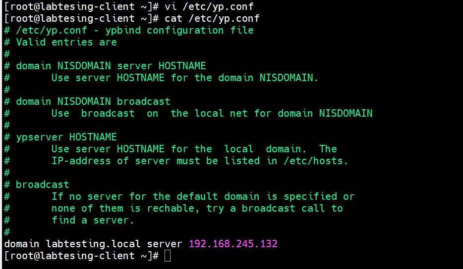


---

### Step 4 — Configure Authentication with authselect

Rocky Linux 8 uses `authselect` to manage PAM and nsswitch configuration.

```bash
# Select NIS authentication profile
authselect select nis --force

# Enable auto home directory creation
authselect enable-feature with-mkhomedir

# Apply all changes
authselect apply-changes
```

> **What `authselect select nis --force` does:** The `--force` flag overwrites any existing authselect profile. This automatically updates `/etc/nsswitch.conf` to include NIS lookups for all critical services (passwd, shadow, group, hosts, etc.).

> **What `with-mkhomedir` does:** Configures PAM to use `pam_mkhomedir`, which creates `/home/username` automatically when a NIS user logs in for the first time.


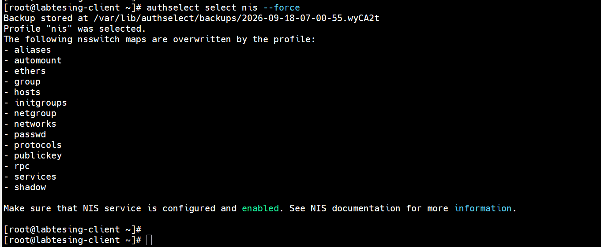

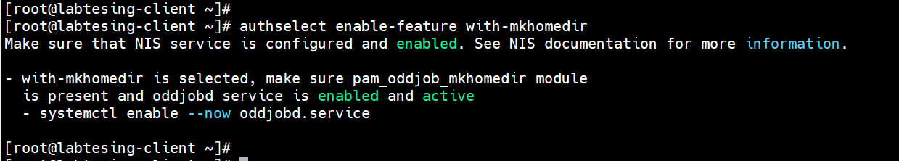

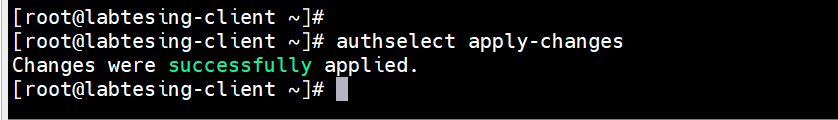


---

### Step 5 — Verify /etc/nsswitch.conf

```bash
cat /etc/nsswitch.conf
```

> **What this shows:** The `nsswitch.conf` file controls the order in which the system looks up information. It should show `files nis` for all key services — meaning: check local files first, then query NIS.
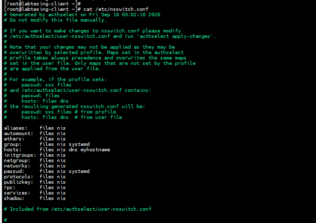

---

### Step 6 — Enable & Start Client Services

```bash
# Start rpcbind first
systemctl enable --now rpcbind

# Start NIS client daemon
systemctl enable --now ypbind.service
```
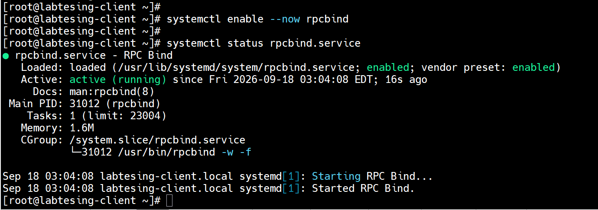


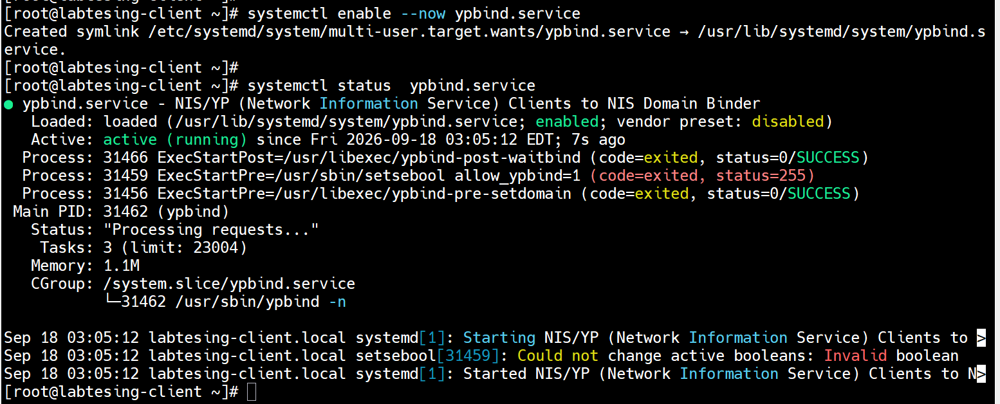


> 💡 **Note:** The `setsebool allow_ypbind=1` warning (`status=255`) is harmless — it indicates SELinux is in permissive or disabled mode. `ypbind` is running successfully regardless.

---

## 4. Final Verification & Testing {#verification}

### Test 1 — Verify NIS Server Binding

```bash
ypwhich
```

> **What this does:** `ypwhich` (Yellow Pages Which) returns the IP or hostname of the NIS server the client is currently bound to. A result of `192.168.245.132` confirms the client is successfully connected.

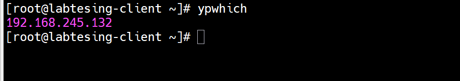
*Figure 27: ypwhich — client bound to 192.168.245.132 (NIS Server) ✅*

---

### Test 2 — Create a NIS User on Server

On the **NIS SERVER**:

```bash
useradd nisuer01
passwd nisuer01
```

> **What this does:** `useradd` creates the local user account. `passwd` sets the password. This user will be distributed to all NIS clients after the maps are rebuilt.

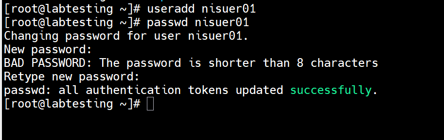
*Figure 28: NIS Server — user nisuer01 created with password set successfully*

---

### Test 3 — Rebuild NIS Maps

After adding any user on the server, you **MUST** rebuild the NIS maps:

```bash
make -C /var/yp
```

> **What this does:** Runs the NIS Makefile in `/var/yp`, which reads `/etc/passwd`, `/etc/group`, etc., and rebuilds all NIS database maps. The `-C` flag tells `make` to change to that directory first. Only **changed maps** are updated (efficient incremental rebuild).

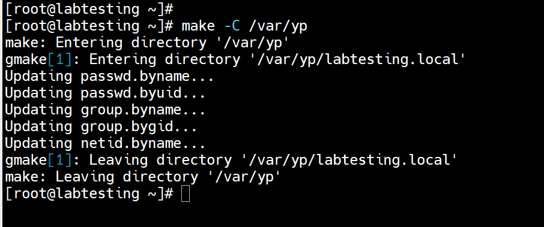
*Figure 29: NIS maps rebuilt — passwd, group, netid maps updated with nisuer01*

---

### Test 4 — Verify User Visible on Client ✅

On the **NIS CLIENT**:

```bash
getent passwd nisuer01
```

> **What this does:** `getent` (get entries) queries the Name Service Switch (NSS) databases. Since `nsswitch.conf` includes NIS, this fetches the user entry from the NIS server. A successful result proves **end-to-end NIS authentication is working**.

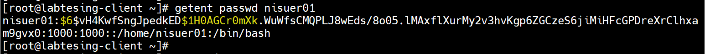
*Figure 30: getent passwd nisuer01 — user fetched from NIS server ✅*

> 💡 **Note:** The hashed password visible in the output is the SHA-512 hash (`$6$...`). This is normal — the actual password is never shown in plain text.

---

## 5. Key Commands Reference {#reference}

### Server Commands

| Command | Purpose |
|---------|---------|
| `dnf install -y ypserv rpcbind` | Install NIS server packages |
| `nisdomainname <domain>` | Set NIS domain name (session) |
| `echo "NISDOMAIN=..." >> /etc/sysconfig/network` | Make domain persistent |
| `/usr/lib64/yp/ypinit -m` | Initialize NIS master server & build maps |
| `make -C /var/yp` | Rebuild NIS maps after any changes |
| `systemctl enable --now ypserv` | Enable & start NIS server daemon |
| `rpcinfo -p localhost` | List all registered RPC services |

### Client Commands

| Command | Purpose |
|---------|---------|
| `dnf install -y ypbind rpcbind oddjob-mkhomedir` | Install NIS client packages |
| `authselect select nis --force` | Configure system to use NIS auth |
| `authselect enable-feature with-mkhomedir` | Enable auto home dir creation |
| `systemctl enable --now ypbind` | Enable & start NIS client daemon |
| `ypwhich` | Show which NIS server client is bound to |
| `ypcat passwd` | Display all NIS password map entries |
| `getent passwd <user>` | Lookup user via NSS (NIS + local) |
| `ypdomainname` | Display current NIS domain name |

### NIS Services & Ports

| Service | Daemon | Port | Purpose |
|---------|--------|------|---------|
| portmapper | rpcbind | 111 | RPC service registry |
| ypserv | ypserv | 751 | NIS map server |
| yppasswdd | rpc.yppasswdd | 757 | Password change service |
| ypxfrd | rpc.ypxfrd | 744 | Map transfer accelerator |

---

This guide demonstrated a complete **NIS (Network Information Service)** setup on Rocky Linux 8.10, covering both server and client configuration from scratch.

### What was accomplished:
- ✅ Installed and configured `ypserv` as NIS master server on Rocky Linux 8.10
- ✅ Set up NIS domain `labtesting.local` with proper subnet access control
- ✅ Built and initialized all NIS maps using `ypinit -m`
- ✅ Configured NIS client with `ypbind` and `authselect` NIS profile
- ✅ Verified end-to-end: user created on server → visible on client via `getent`

NIS provides a simple, effective way to **centralize user management** across Linux systems in a network — making it ideal for lab environments, small teams, and legacy system integrations.

---

*Document prepared as part of  lab practice.*  
*Rocky Linux 8.10 | NIS/YP |