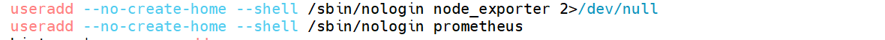
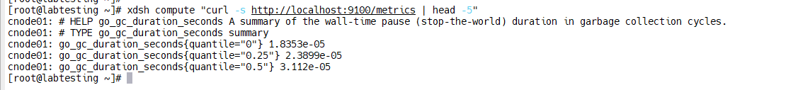
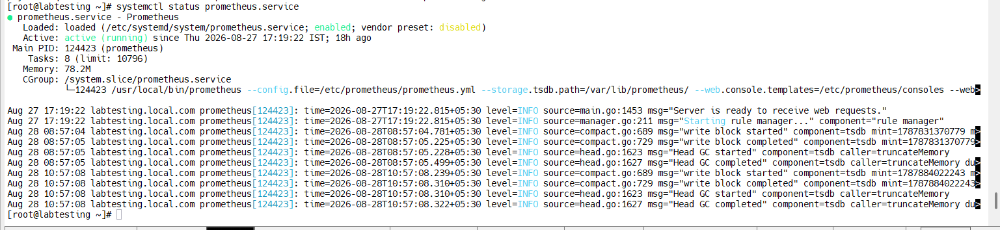
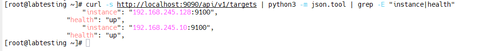
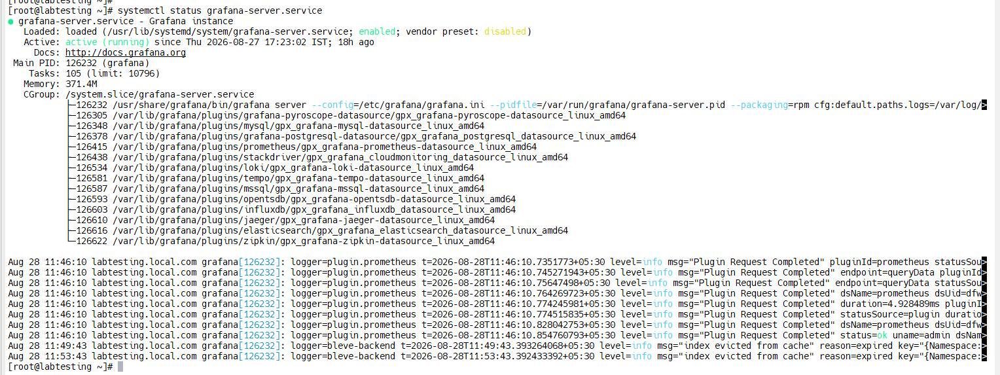
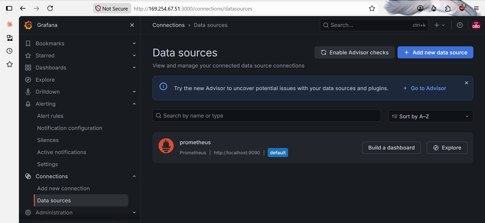
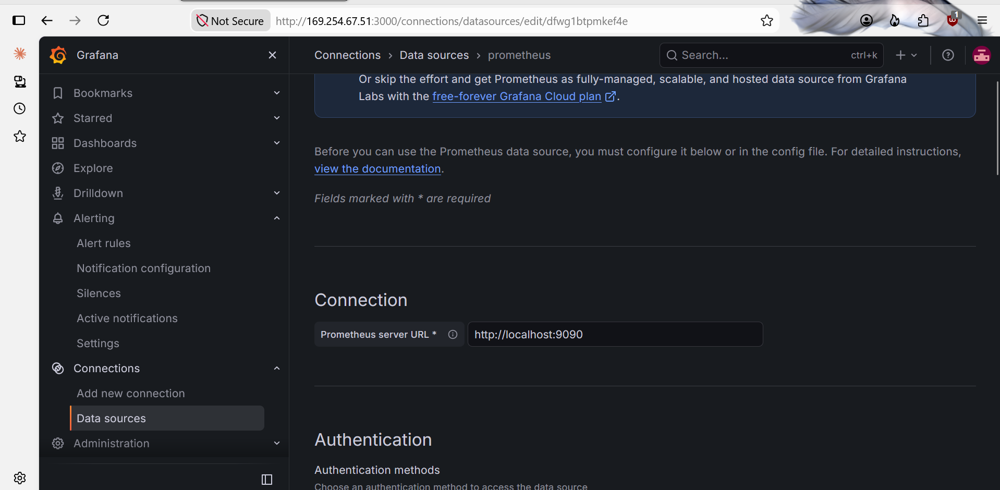
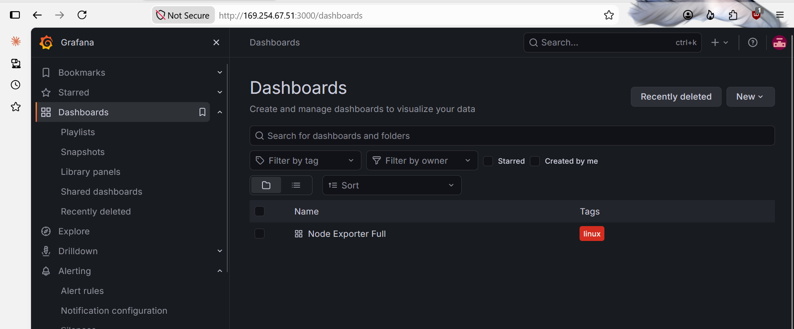
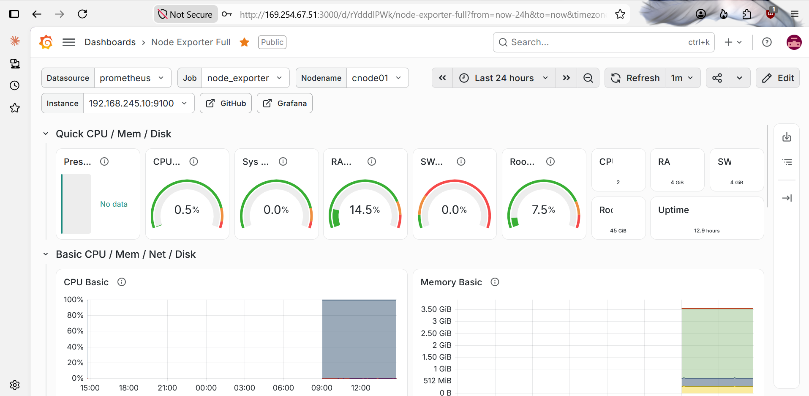
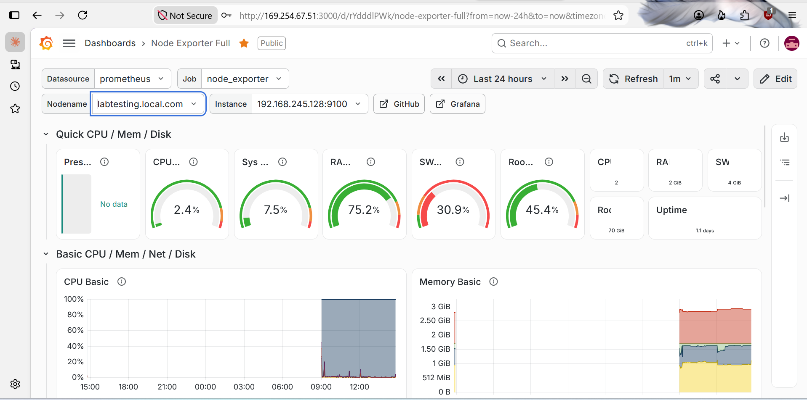

# Grafana & Prometheus Monitoring for xCAT-Provisioned Cluster

> **Environment:** Rocky Linux 8.10 · xCAT-Provisioned Cluster · Lab Validation  
> **Stack:** `node_exporter` on all nodes + Prometheus and Grafana on the master

## 1. Architecture

### Where Each Component Runs

| Component | Master | Compute Nodes |
|---|---|---|
| `node_exporter` | ✅ | ✅ |
| Prometheus | ✅ | ❌ |
| Grafana | ✅ | ❌ |

**Important:** `node_exporter` runs on **every node**, including the master and every compute node. It exposes system metrics on port `9100`.

**Prometheus runs only on the master.** It pulls metrics from every node's `node_exporter` over the network.

**Grafana runs only on the master.** It queries Prometheus and displays the metrics in a browser.

> **Do not install Prometheus, create a Prometheus user, or copy `prometheus.yml` to compute nodes.** A compute node only needs `node_exporter`.

---

## 2. Environment Overview

| Field | Value |
|---|---|
| Master node | `labtesting.local.com` (`192.168.245.128`) |
| Compute node | `cnode01` (`192.168.245.10`) |
| OS | Rocky Linux 8.10 |
| `node_exporter` | 1.12.1 |
| Prometheus | 3.14.0 |
| Grafana | 13.2.0 |
| Prometheus Web UI / API | `http://192.168.245.128:9090` |
| Grafana Web UI | `http://192.168.245.128:3000` |

---

# Phase 1 — node_exporter on the Master

> Run this phase directly on the **master**. The master is not provisioned through xCAT postscripts in the same way as compute nodes.

## 1.1 Create a Dedicated Service User

```bash
useradd --no-create-home --shell /sbin/nologin node_exporter
```

### Why This Matters

`node_exporter` only needs to read `/proc` and `/sys` to report metrics. Running it as a dedicated non-login user avoids unnecessary root privileges.

### Verify

```bash
id node_exporter
```

The user should exist with no valid login shell.

---

## 1.2 Download and Install node_exporter

```bash
cd /tmp

wget https://github.com/prometheus/node_exporter/releases/download/v1.12.1/node_exporter-1.12.1.linux-amd64.tar.gz

tar xvfz node_exporter-1.12.1.linux-amd64.tar.gz

cp node_exporter-1.12.1.linux-amd64/node_exporter /usr/local/bin/

chown node_exporter:node_exporter /usr/local/bin/node_exporter
```

### Why This Matters

`node_exporter` is distributed as a static binary, so it can be installed directly without using the package manager.

### Verify

```bash
ls -l /usr/local/bin/node_exporter
```

The binary should be owned by:

```text
node_exporter:node_exporter
```

### Pitfall: `chown` Input Duplication

During the lab, a `chown` command was accidentally duplicated/concatenated in the terminal, producing `cannot access` errors.

This was a terminal input/paste issue rather than an installation problem.

If this happens, retype the clean command:

```bash
chown node_exporter:node_exporter /usr/local/bin/node_exporter
```

---

## 1.3 Create the systemd Service

```bash
cat > /etc/systemd/system/node_exporter.service << 'EOF'
[Unit]
Description=Node Exporter
After=network-online.target

[Service]
User=node_exporter
Group=node_exporter
Type=simple
ExecStart=/usr/local/bin/node_exporter

[Install]
WantedBy=multi-user.target
EOF
```

Start and enable the service:

```bash
systemctl daemon-reload
systemctl enable --now node_exporter
```

### Verify

```bash
systemctl status node_exporter
```

The service should show:

```text
active (running)
```

Test the metrics endpoint:

```bash
curl -s http://localhost:9100/metrics | head -5
```

Real Prometheus metrics should be returned.



---

# Phase 2 — node_exporter on Compute Nodes

> **This is the only monitoring component installed on compute nodes.**

## 2.1 Create the xCAT Postscript

Create:

```bash
cat > /install/postscripts/setup_node_exporter << 'EOF'
#!/bin/bash

useradd --no-create-home --shell /sbin/nologin node_exporter 2>/dev/null

cd /tmp

curl -sL -o node_exporter.tar.gz \
https://github.com/prometheus/node_exporter/releases/download/v1.12.1/node_exporter-1.12.1.linux-amd64.tar.gz

tar xzf node_exporter.tar.gz

cp node_exporter-1.12.1.linux-amd64/node_exporter /usr/local/bin/

chown node_exporter:node_exporter /usr/local/bin/node_exporter

cat > /etc/systemd/system/node_exporter.service << 'SVC'
[Unit]
Description=Node Exporter
After=network-online.target

[Service]
User=node_exporter
Group=node_exporter
Type=simple
ExecStart=/usr/local/bin/node_exporter

[Install]
WantedBy=multi-user.target
SVC

systemctl daemon-reload
systemctl enable --now node_exporter

echo "node_exporter installed and running"
EOF
```

Make it executable:

```bash
chmod +x /install/postscripts/setup_node_exporter
```

### Critical Verification

Immediately check the first line:

```bash
head -1 /install/postscripts/setup_node_exporter
```

It must print exactly:

```text
#!/bin/bash
```

### Pitfall: Text Accidentally Added Above the Shebang

During the lab, the postscript initially failed with:

```text
./setup_node_exporter: line 1: The: command not found
```

The cause was an explanatory sentence accidentally pasted above the `#!/bin/bash` line.

Always verify the first line before running the postscript against nodes.

---

## 2.2 Push to the Compute Group

Assign the postscript:

```bash
chdef compute -p postscripts=setup_node_exporter
```

Push it:

```bash
updatenode compute -P setup_node_exporter
```

### Verify

```bash
xdsh compute "curl -s http://localhost:9100/metrics | head -5"
```

Each compute node should return real metrics.



---

# Phase 3 — Prometheus Server

> **MASTER ONLY — do not run these commands on compute nodes.**

## 3.1 Create the Prometheus User and Directories

```bash
useradd --no-create-home --shell /sbin/nologin prometheus

mkdir -p /etc/prometheus /var/lib/prometheus
```

---

## 3.2 Download and Install Prometheus

```bash
cd /tmp

wget https://github.com/prometheus/prometheus/releases/download/v3.14.0/prometheus-3.14.0.linux-amd64.tar.gz

tar xvfz prometheus-3.14.0.linux-amd64.tar.gz

cd prometheus-3.14.0.linux-amd64

cp prometheus promtool /usr/local/bin/
```

### Prometheus 3.x Console Directory Note

Older Prometheus installation guides may contain:

```bash
cp -r consoles console_libraries /etc/prometheus/
```

For the Prometheus 3.x release used in this lab, those directories are not included in the release tarball.

Therefore, **do not run that copy command**.

Also, do not add the old:

```text
--web.console.templates
--web.console.libraries
```

options to the Prometheus 3.x service.

### Verify

```bash
ls /tmp/prometheus-3.14.0.linux-amd64/
```

The release should contain the Prometheus binaries and configuration files without the old `consoles/` and `console_libraries/` directories.

---

## 3.3 Set Ownership

```bash
chown -R prometheus:prometheus \
/etc/prometheus \
/var/lib/prometheus \
/usr/local/bin/prometheus \
/usr/local/bin/promtool
```

---

## 3.4 Configure Prometheus Scrape Targets

Create the configuration:

```bash
cat > /etc/prometheus/prometheus.yml << 'EOF'
global:
  scrape_interval: 15s

scrape_configs:
  - job_name: 'node_exporter'
    static_configs:
      - targets:
          - '192.168.245.128:9100'
          - '192.168.245.10:9100'
EOF
```

Set ownership:

```bash
chown prometheus:prometheus /etc/prometheus/prometheus.yml
```

### Why This Matters

Both IP addresses are `node_exporter` endpoints:

- `192.168.245.128:9100` — master
- `192.168.245.10:9100` — `cnode01`

Prometheus reaches out to these endpoints. **Nothing needs to be copied to the compute node.**

### Verify

```bash
cat /etc/prometheus/prometheus.yml
```

---

## 3.5 Create the Prometheus systemd Service

```bash
cat > /etc/systemd/system/prometheus.service << 'EOF'
[Unit]
Description=Prometheus
Wants=network-online.target
After=network-online.target

[Service]
User=prometheus
ExecStart=/usr/local/bin/prometheus \
  --config.file=/etc/prometheus/prometheus.yml \
  --storage.tsdb.path=/var/lib/prometheus/

[Install]
WantedBy=multi-user.target
EOF
```

Start the service:

```bash
systemctl daemon-reload
systemctl enable --now prometheus
```

### Verify

```bash
systemctl status prometheus
```

It should show:

```text
active (running)
```

There should be no errors about missing console directories.



---

## 3.6 Confirm Both Targets Are Being Scraped

Run on the master:

```bash
curl -s http://localhost:9090/api/v1/targets | \
python3 -m json.tool | grep -E "instance|health"
```

### Expected Result

Both targets should report:

```text
"health": "up"
```

Expected instances:

```text
192.168.245.128:9100
192.168.245.10:9100
```

This confirms that Prometheus can reach both `node_exporter` endpoints and successfully scrape metrics.



---

# Phase 4 — Grafana

> **MASTER ONLY**

## 4.1 Add the Grafana Repository

```bash
wget -q -O /tmp/gpg.key https://rpm.grafana.com/gpg.key

rpm --import /tmp/gpg.key

tee /etc/yum.repos.d/grafana.repo << 'EOF'
[grafana]
name=Grafana OSS
baseurl=https://rpm.grafana.com
repo_gpgcheck=1
enabled=1
gpgcheck=1
gpgkey=https://rpm.grafana.com/gpg.key
sslverify=1
sslcacert=/etc/pki/tls/certs/ca-bundle.crt
EOF
```

---

## 4.2 Install and Start Grafana

```bash
dnf install -y grafana

systemctl daemon-reload

systemctl enable --now grafana-server
```

### Verify

```bash
systemctl status grafana-server
```

The service should show:

```text
active (running)
```



---

## 4.3 Log In and Change the Default Password

Open:

```text
http://192.168.245.128:3000
```

Default credentials:

```text
Username: admin
Password: admin
```

On the first login, change the default password.

### Verify

After changing the password, the Grafana home screen should load.



---

## 4.4 Add Prometheus as a Data Source

In Grafana:

1. Open **Connections**
2. Select **Data sources**
3. Select **Add data source**
4. Select **Prometheus**
5. Set the URL to:

```text
http://localhost:9090
```

6. Click **Save & Test**

A successful connection should display a green success message.

### Why This Matters

Grafana does not store the monitoring metrics in this setup. Grafana queries Prometheus, which stores and provides the metrics.



---

# Phase 5 — Import the Node Exporter Dashboard

## 5.1 Import Dashboard 1860

In Grafana:

1. Open **Dashboards**
2. Select **New**
3. Select **Import**
4. Enter dashboard ID:

```text
1860
```

5. Select the Prometheus data source created above.
6. Click **Import**.

Dashboard **1860 — Node Exporter Full** provides commonly used node metrics such as:

- CPU
- Memory
- Disk
- Network

### Verify

The dashboard should load with live data.

Use the **Nodename** dropdown to switch between:

- Master
- `cnode01`



---

# 6. Full Verification Checklist

Run the following checks after completing the installation.

### Master node_exporter

```bash
curl -s http://localhost:9100/metrics | head -5
```

Expected: real metrics are returned.

### Compute node_exporter

```bash
xdsh compute "curl -s http://localhost:9100/metrics | head -5"
```

Expected: real metrics are returned from compute nodes.

### Prometheus

```bash
systemctl status prometheus
```

Expected:

```text
active (running)
```

### Prometheus targets

```bash
curl -s http://localhost:9090/api/v1/targets
```

Expected:

```text
192.168.245.128:9100 → health: up
192.168.245.10:9100  → health: up
```

### Grafana

```bash
systemctl status grafana-server
```

Expected:

```text
active (running)
```

### Grafana Dashboard

Dashboard **1860** should display live data for the master and `cnode01`.





> **Expected VM behavior:** A blank or `No data` CPU temperature/hwmon panel is expected when the guest VM does not expose real hardware thermal sensors.

---

# 7. Issue Log and Fixes

| Issue | Cause | Fix |
|---|---|---|
| `setup_node_exporter: line 1: The: command not found` | Text was accidentally pasted above the `#!/bin/bash` shebang | Run `head -1 <postscript>` and ensure the first line is exactly `#!/bin/bash` |
| `chown` produced `cannot access` errors | Terminal input duplication/mangled command | Retype the clean command and verify it before execution |
| `cp -r consoles console_libraries /etc/prometheus/` failed | Prometheus 3.x no longer ships these old console directories | Skip the copy and remove old console flags |
| `scp prometheus.yml` to compute node failed | Prometheus server does not run on compute nodes | Keep Prometheus configuration on the master only |
| `prometheus:prometheus` user invalid on `cnode01` | Prometheus was incorrectly being configured on the compute node | Do not create a Prometheus user, config, or service on compute nodes |

---

# 8. Production Deployment Notes

## 8.1 Security

The lab configuration uses Grafana over plain HTTP:

```text
http://192.168.245.128:3000
```

Before production sign-off:

- Confirm the default Grafana password has been changed.
- Enable TLS.
- Consider placing Grafana behind a reverse proxy such as nginx or Apache, or configure Grafana's own TLS support.

## 8.2 Scaling to More Compute Nodes

The current `prometheus.yml` uses manually defined targets.

For additional nodes, you can either add their `IP:9100` entries manually and reload Prometheus:

```bash
curl -X POST http://localhost:9090/-/reload
```

Or move to `file_sd_configs` and generate the target file automatically from the xCAT node list.

For example, the target list can be generated from:

```bash
nodels compute
```

## 8.3 Grafana Backup

Include:

```text
/var/lib/grafana
```

in your backup routine because it contains Grafana data such as dashboards, data sources, and users.

## 8.4 Alerting

This guide focuses on dashboards and monitoring visibility.

A useful next step is to configure alerts for:

- Node down
- Disk full
- High CPU load
- High memory usage
- Other cluster health conditions

---

# 9. Monitoring Architecture

```text
                         +----------------------+
                         |    Prometheus        |
                         |      MASTER          |
                         |      :9090           |
                         +----------+-----------+
                                    |
                         Scrapes metrics from
                                    |
             +----------------------+----------------------+
             |                                             |
             v                                             v
+--------------------------+                 +--------------------------+
|       Master             |                 |       cnode01            |
|   node_exporter :9100    |                 |   node_exporter :9100    |
+--------------------------+                 +--------------------------+
             ^
             |
             | Queries
             |
+--------------------------+
|        Grafana           |
|         MASTER           |
|         :3000            |
+--------------------------+
```

### Data Flow

```text
Compute/Master node
       |
       | node_exporter :9100
       v
Prometheus :9090
       |
       | PromQL queries
       v
Grafana :3000
       |
       v
Web Browser
```

---

# 10. Quick Command Reference

| Task | Command |
|---|---|
| Check node_exporter | `systemctl status node_exporter` |
| Test node_exporter | `curl -s http://localhost:9100/metrics \| head -5` |
| Create xCAT postscript | `vi /install/postscripts/setup_node_exporter` |
| Verify postscript shebang | `head -1 /install/postscripts/setup_node_exporter` |
| Assign postscript | `chdef compute -p postscripts=setup_node_exporter` |
| Push postscript | `updatenode compute -P setup_node_exporter` |
| Test all compute nodes | `xdsh compute "curl -s http://localhost:9100/metrics \| head -5"` |
| Check Prometheus | `systemctl status prometheus` |
| Check Prometheus targets | `curl -s http://localhost:9090/api/v1/targets` |
| Check Grafana | `systemctl status grafana-server` |
| Grafana URL | `http://192.168.245.128:3000` |
| Prometheus URL | `http://192.168.245.128:9090` |
| Dashboard | `1860 — Node Exporter Full` |

---

## 11. Final Result

The lab monitoring stack was successfully validated with:

```text
Rocky Linux 8.10
        |
        +---- xCAT
        |
        +---- node_exporter
        |       |
        |       +---- Master
        |       +---- cnode01
        |
        +---- Prometheus 3.14.0
        |       |
        |       +---- Scrapes both node_exporter endpoints
        |
        +---- Grafana 13.2.0
                |
                +---- Prometheus data source
                +---- Dashboard 1860
```

The validated pipeline is:

**xCAT → node_exporter → Prometheus → Grafana → Web Dashboard**
