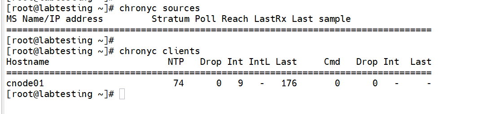
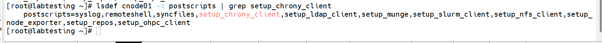
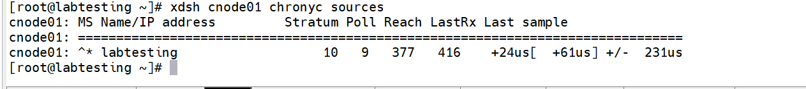
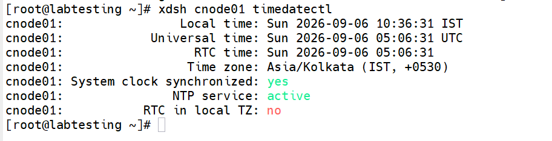

# Configuring Chrony NTP Sync for xCAT Compute Nodes

> **Lab environment:** `labtesting` (xCAT Management Node) — Rocky Linux 8.10

## 1. Overview

This document describes the procedure used to configure **chrony (NTP) time synchronization** on xCAT-managed compute nodes.

The compute node is configured to synchronize its system clock against the **xCAT Management Node (MN)** rather than an external time source.

The configuration is delivered through a custom **xCAT postscript**, assigned to the target node, and pushed using `updatenode`.

---

## 2. Environment Details

| Item | Value |
|---|---|
| Management Node | `labtesting` (`192.168.245.128`) |
| Compute Node | `cnode01` |
| Operating System | Rocky Linux 8.10 |
| Provisioning Tool | xCAT |
| Time Service | chronyd |
| Timezone | Asia/Kolkata (IST, +0530) |

---

## 3. Procedure

### 3.1 Verify chronyd State on the Management Node

Before making changes, confirm that `chronyd` is running on the management node and check its current time sources and connected clients.

```bash
chronyc sources
chronyc clients
```



---

### 3.2 Create the xCAT Postscript

Create a custom postscript named `setup_chrony_client` under:

```text
/install/postscripts/
```

The postscript:

1. Resolves the management node IP using the xCAT `$MASTER` variable.
2. Creates `/etc/chrony.conf`.
3. Configures the management node as the NTP server.
4. Enables and restarts `chronyd`.
5. Displays a confirmation message.

Create the postscript:

```bash
vi /install/postscripts/setup_chrony_client
```

Add the following content:

```bash
#!/bin/bash

# Configures this node's chronyd to sync against the xCAT
# management node

MASTER_IP=$(getent hosts $MASTER | awk '{print $1}')

cat > /etc/chrony.conf << CHRONY
server ${MASTER_IP} iburst
driftfile /var/lib/chrony/drift
makestep 1.0 3
rtcsync
logdir /var/log/chrony
CHRONY

systemctl enable --now chronyd
systemctl restart chronyd

echo "chrony client configured against master ${MASTER_IP}"
```

Make the postscript executable:

```bash
chmod +x /install/postscripts/setup_chrony_client
```

---

### 3.3 Assign the Postscript to the Target Node

Add the postscript to the node definition:

```bash
chdef cnode01 -p postscripts=setup_chrony_client
```

Confirm that the postscript has been added:

```bash
lsdef cnode01 -i postscripts
```

Expected output:

```text
Object name: cnode01
 postscripts=syslog,remoteshell,syncfiles,setup_chrony_client
```



---

### 3.4 Push the Postscript to the Node

Run the postscript on the live compute node using `updatenode`:

```bash
updatenode cnode01 -P setup_chrony_client
```

Expected output:

```text
cnode01: postscript start..: setup_chrony_client
cnode01: chrony client configured against master 192.168.245.128
cnode01: postscript end....: setup_chrony_client exited with code 0
```



---

## 4. Verification

### 4.1 Verify the Compute Node's NTP Source

From the management node, check the chrony sources on `cnode01`:

```bash
xdsh cnode01 chronyc sources
```

The management node should appear as the selected (`*`) time source.

Example:

```text
cnode01: ^* labtesting.local.com.lab> 10 6 17 54 +42us[ +299us] +/- 463us
```

---

### 4.2 Verify the Node is Registered as a Chrony Client

On the management node:

```bash
chronyc clients
```

Example:

```text
Hostname  NTP  Drop  Int  IntL  Last  Cmd  Drop  Int  Last
cnode01   13   0     6    -     47    0    0     -    -
```

The presence of `cnode01` confirms that the compute node is actively polling the management node.



---

### 4.3 Verify System Clock Synchronization

On the compute node, verify the system time synchronization state:

```bash
xdsh cnode01 timedatectl
```

Expected output:

```text
cnode01: System clock synchronized: yes
cnode01: NTP service: active
cnode01: Time zone: Asia/Kolkata (IST, +0530)
```

The verification confirms that the system clock is synchronized and the NTP service is active.

---

## 5. Result

The configuration was successfully completed for compute node `cnode01`.

- `cnode01` successfully synchronizes its clock with the xCAT management node `labtesting` (`192.168.245.128`) using chrony.
- `chronyc sources` on `cnode01` shows the management node as the selected (`*`) time source.
- `chronyc clients` on the management node shows `cnode01` actively polling.
- `timedatectl` on `cnode01` confirms:
  - **System clock synchronized:** `yes`
  - **NTP service:** `active`
  - **Timezone:** `Asia/Kolkata (IST, +0530)`

---

## 6. Notes / Follow-ups

### Apply the Configuration to Additional Nodes

The postscript uses xCAT's `$MASTER` variable, so it can automatically resolve the correct management node IP when applied to another node.

For a node range or group:

```bash
chdef <noderange> -p postscripts=setup_chrony_client
```

Then push the postscript:

```bash
updatenode <noderange> -P setup_chrony_client
```

### Automatically Configure Newly Provisioned Nodes

For newly provisioned nodes, consider adding `setup_chrony_client` to the default postscript list of the relevant xCAT `osimage`.

This allows new compute nodes to automatically receive the chrony client configuration during provisioning.

---

## 7. Quick Command Reference

| Purpose | Command |
|---|---|
| Check NTP sources | `chronyc sources` |
| Check NTP clients | `chronyc clients` |
| Create postscript | `vi /install/postscripts/setup_chrony_client` |
| Make postscript executable | `chmod +x /install/postscripts/setup_chrony_client` |
| Assign postscript | `chdef cnode01 -p postscripts=setup_chrony_client` |
| Verify postscript assignment | `lsdef cnode01 -i postscripts` |
| Push postscript | `updatenode cnode01 -P setup_chrony_client` |
| Check node chrony source | `xdsh cnode01 chronyc sources` |
| Check node time status | `xdsh cnode01 timedatectl` |

---

## 8. Architecture

```text
                 NTP / Time Source
                        |
                        v
              +---------------------+
              | xCAT Management Node |
              |     labtesting       |
              |   192.168.245.128    |
              |       chronyd        |
              +----------+----------+
                         |
                  xCAT / Network
                         |
                         v
              +---------------------+
              |   Compute Node       |
              |      cnode01         |
              |       chronyd        |
              +---------------------+
                         |
                         v
                 System Clock Sync
```

**Flow:**

`xCAT Management Node → chronyd → cnode01 chronyd → synchronized system clock`
