# SNMP Network Monitoring — Complete Installation Guide

**snmp_exporter + net-snmp + Prometheus + Grafana**

Rocky Linux 8.10 · Prometheus 3.14.0 · Grafana 13.2.0 · snmp_exporter 0.30.1


---

## 1. Architecture  

> **Where each component runs:** `snmp_exporter` runs on the **master only**. It polls remote devices over SNMP and translates the results into Prometheus metrics. Prometheus (also master-only) scrapes `snmp_exporter`, not the monitored device directly — the device being monitored never needs any Prometheus/Grafana component installed on it, only an SNMP agent (`snmpd`) answering queries.

In this guide, the master node itself is used as the monitored device (via a local `net-snmp` agent) — a practical stand-in when no separate firewall/router appliance is available in the lab.

## 2. Environment

| Field | Value |
|---|---|
| Master node | labtesting.local.com (192.168.245.128) |
| snmp_exporter version | 0.30.1 |
| snmp_exporter port | 9116 |
| Monitored device (this guide) | The master itself, via local net-snmp agent on port 161 |
| Prometheus scrape job | `snmp`, module `if_mib` |
| Grafana dashboard used | ID `23022` — "SNMP Stats" |

---

## Phase 1 — Install snmp_exporter

### 1.1 Download the release

```bash
cd /tmp
wget https://github.com/prometheus/snmp_exporter/releases/download/v0.30.1/snmp_exporter-0.30.1.linux-amd64.tar.gz
```

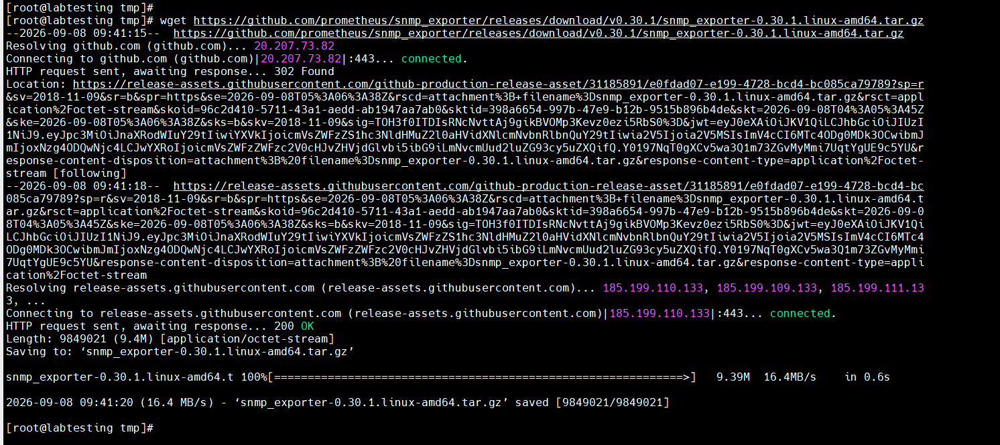

### 1.2 Extract it

```bash
tar xvf snmp_exporter-0.30.1.linux-amd64.tar.gz
```

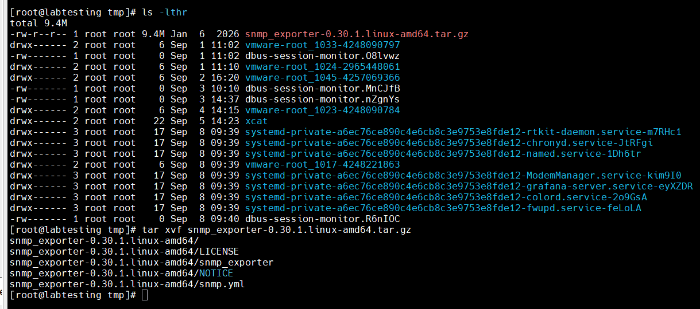

### 1.3 Install the binary and default config

```bash
cd snmp_exporter-0.30.1.linux-amd64
cp snmp_exporter /usr/local/bin/
mkdir -p /etc/snmp_exporter
cp snmp.yml /etc/snmp_exporter/
```

> **Why:** the bundled `snmp.yml` is pre-generated with thousands of standard OID mappings (via the `if_mib` module) so a working config exists without hand-writing one.

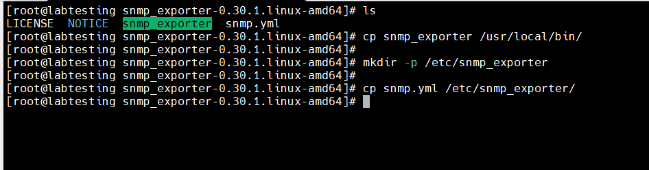

### 1.4 Create a dedicated service user

```bash
useradd --no-create-home --shell /sbin/nologin snmp_exporter
chown snmp_exporter:snmp_exporter /usr/local/bin/snmp_exporter
chown snmp_exporter:snmp_exporter /etc/snmp_exporter/snmp.yml
```

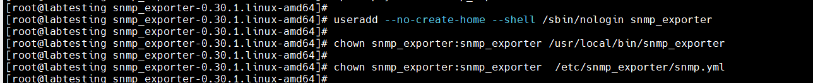

---

## Phase 2 — systemd Service

### 2.1 Create the service file

```bash
cat > /etc/systemd/system/snmp_exporter.service << 'EOF'
[Unit]
Description=SNMP Exporter
After=network-online.target

[Service]
User=snmp_exporter
Type=simple
ExecStart=/usr/local/bin/snmp_exporter --config.file=/etc/snmp_exporter/snmp.yml

[Install]
WantedBy=multi-user.target
EOF
```

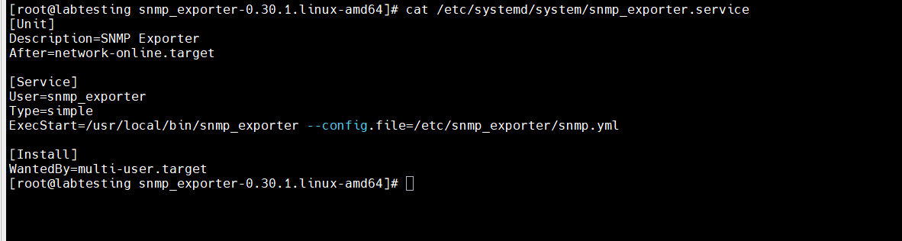

### 2.2 Enable and start it

```bash
systemctl daemon-reload
systemctl enable --now snmp_exporter
```

**Verify:** `systemctl status snmp_exporter` — must show `active (running)` and `Listening on address=[::]:9116`.

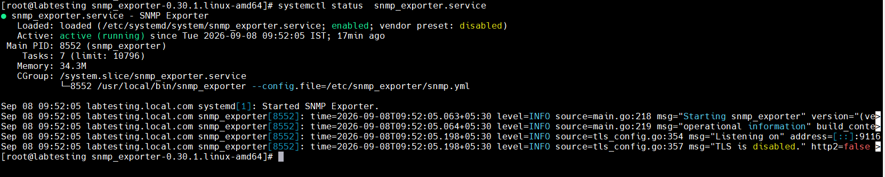

---

## Phase 3 — Monitored Device Setup (net-snmp agent)

This phase installs an SNMP agent to be queried. On a real deployment this would already exist on the firewall/router; here it's installed locally on the master as a stand-in.

### 3.1 Install net-snmp

```bash
dnf install -y net-snmp net-snmp-utils
```

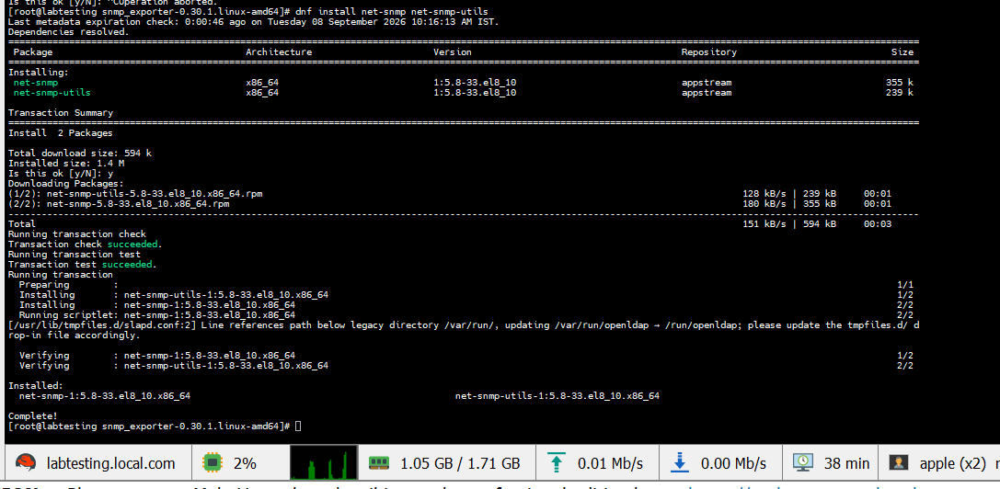

### 3.2 Configure the agent

```bash
cat > /etc/snmp/snmpd.conf << 'EOF'
rocommunity public 127.0.0.1
syslocation "Lab"
syscontact admin@labtesting.local.com
EOF
```

> ⚠️ **Pitfall we hit:** The IP after `rocommunity public` is a **source restriction**, not a target — it means only SNMP queries whose *source* address is `127.0.0.1` are answered. Querying the same host by its real IP (`192.168.245.128`) later caused a timeout, because the outgoing query's source address didn't match. **Fix:** changed this to `rocommunity public default` to accept queries from any source (appropriate for a private lab subnet only, not internet-facing).

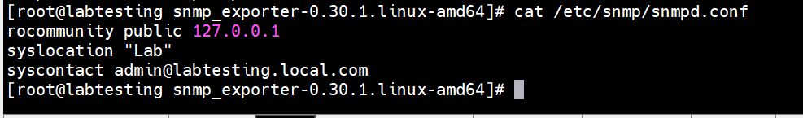

### 3.3 Enable and start the agent

```bash
systemctl enable --now snmpd
```

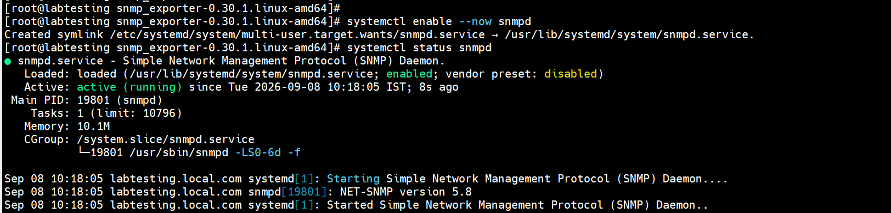

---

## Phase 4 — Verify the Full Local Chain

```bash
curl -s "http://localhost:9116/snmp?target=127.0.0.1&module=if_mib" | head -10
snmpwalk -v2c -c public 127.0.0.1 system
```

> **Why both commands:** testing `snmp_exporter`'s own endpoint AND a direct `snmpwalk` both confirm the two halves of the chain independently — the agent answering, and the exporter successfully querying and translating that answer into Prometheus format.

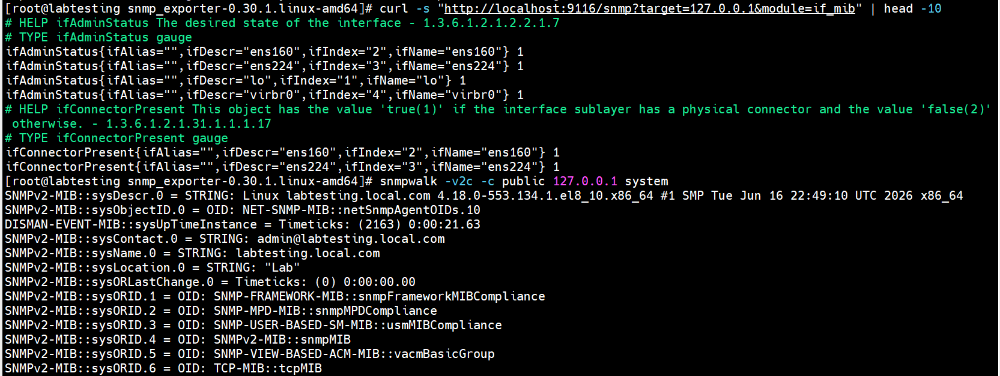

---

## Phase 5 — Prometheus Scrape Configuration

```yaml
  - job_name: 'snmp'
    static_configs:
      - targets:
          - '127.0.0.1'   # later changed to 192.168.245.128, see Appendix
    metrics_path: /snmp
    params:
      module: [if_mib]
    relabel_configs:
      - source_labels: [__address__]
        target_label: __param_target
      - source_labels: [__param_target]
        target_label: instance
      - target_label: __address__
        replacement: 127.0.0.1:9116
```

> **Why:** Prometheus doesn't scrape the monitored device directly — it scrapes `snmp_exporter`, and relabeling passes the real device's address as a query parameter. This is why the *address* Prometheus connects to (`snmp_exporter`, port 9116) differs from the *instance* label shown on dashboards (the actual monitored device).

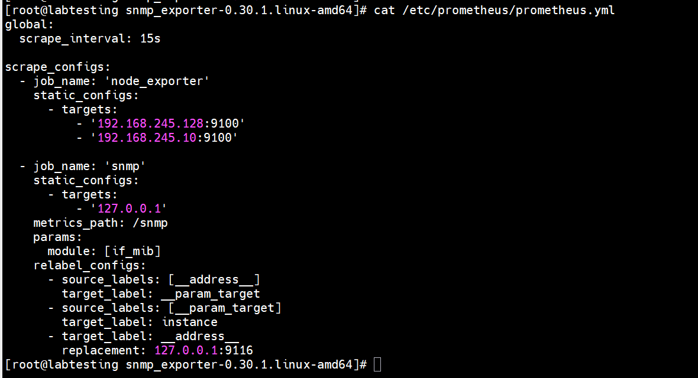

> ⚠️ **Pitfall we hit:** The systemd service originally used Prometheus 2.x-style flags (`--web.console.templates`, `--web.console.libraries`) which reference directories Prometheus 3.x no longer ships. Also, `--web.enable-lifecycle` was missing, so `curl -X POST http://localhost:9090/-/reload` failed with `Lifecycle API is not enabled.` **Fix:** rewrote the service file to drop the console flags and add `--web.enable-lifecycle`, then `systemctl daemon-reload && systemctl restart prometheus`.

---

## Phase 6 — Grafana Dashboard

### 6.1 First attempt — dashboard ID 13649 failed

> ⚠️ **Pitfall we hit:** Dashboard ID `13649` ("Rosey Dashboard" — not actually SNMP-specific despite being suggested as one) failed to import with "Unknown error". Root cause: it's an old (2022) dashboard, almost certainly built on Angular-based panels, which Grafana removed support for in recent versions (this setup runs Grafana 13.2.0).

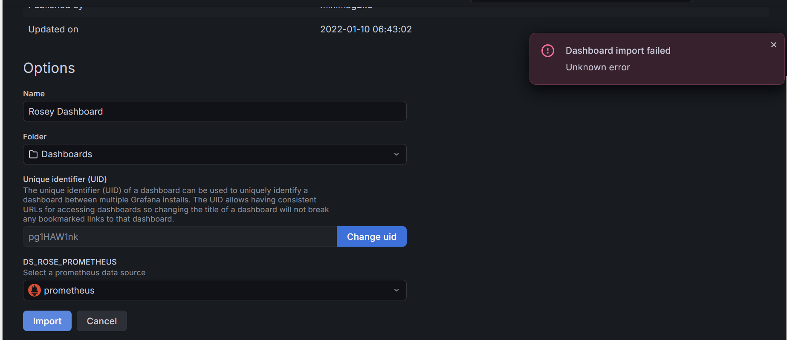

### 6.2 Working dashboard — ID 23022 ("SNMP Stats")

Dashboards → New → Import → enter `23022` → select the Prometheus data source → Import.

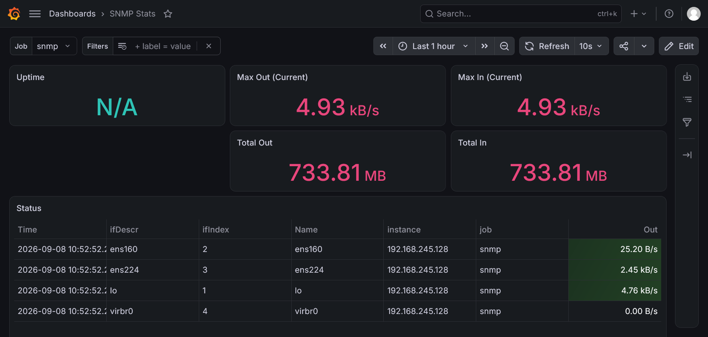

### 6.3 Fixing the "Uptime: N/A" panel

> ⚠️ **Pitfall we hit:** The dashboard's default Uptime panel queried `sysUpTime`, which is **not** collected by the `if_mib` module (it only walks interface-related OIDs). Confirmed via:
> ```bash
> curl -s ".../snmp?...&module=if_mib" | grep -i uptime
> ```
> returning no `sysUpTime` metric. **Fix:** removed the panel rather than chasing an OID outside this module's scope.

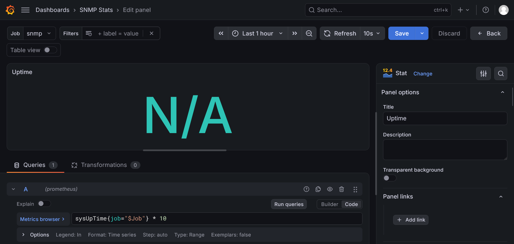

### 6.4 Adding a custom Interface Errors panel

Replaced the removed Uptime panel with a more useful one for a monitoring goal focused on the firewall/network — an errors-per-second panel:

```promql
rate(ifInErrors{instance="192.168.245.128"}[5m]) + rate(ifOutErrors{instance="192.168.245.128"}[5m])
```

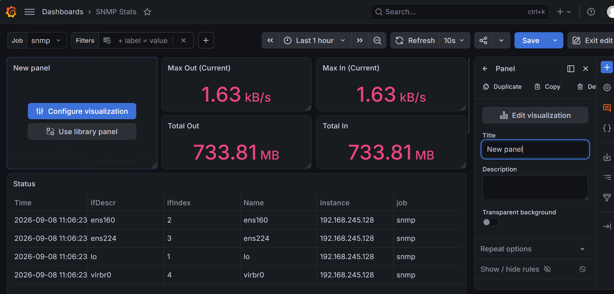
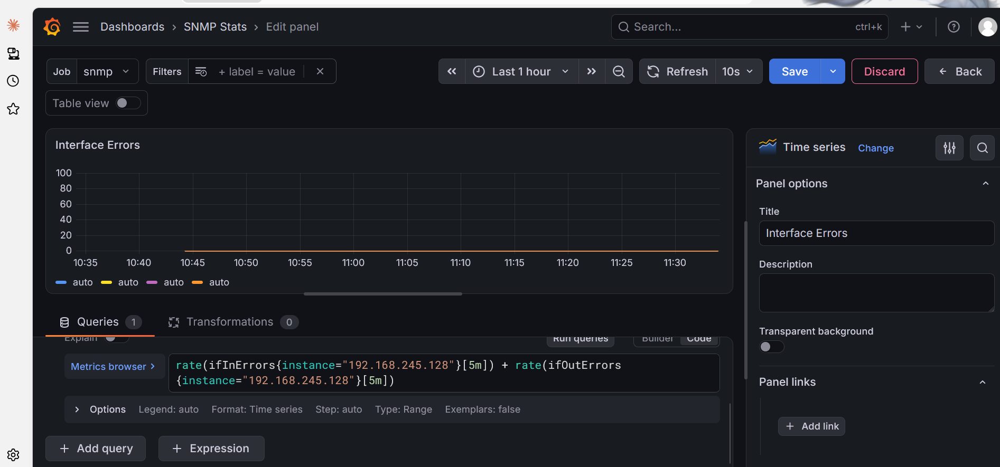

### 6.5 Configuring the red/green threshold

> ⚠️ **Pitfall we hit:** The Thresholds section is **not** inside the Unit picker — clicking near "Unit" opened an unrelated unit-category dropdown (Rotational Speed, Temperature, Time, etc.). The Thresholds section is its own separate collapsible block further down the Standard Options panel. **Fastest way to find it:** use the magnifying-glass search icon at the top of the options panel and type `threshold` to filter directly to it.

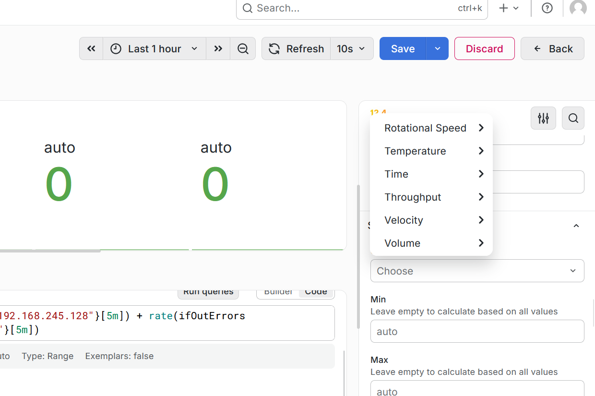
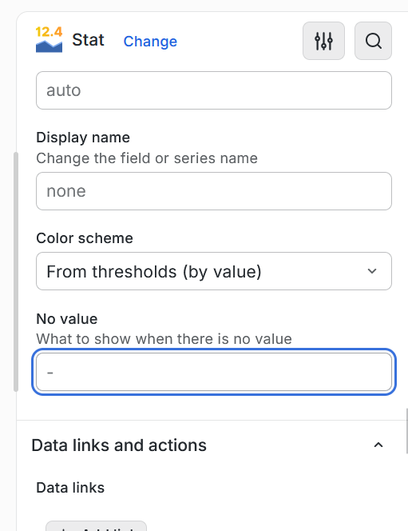
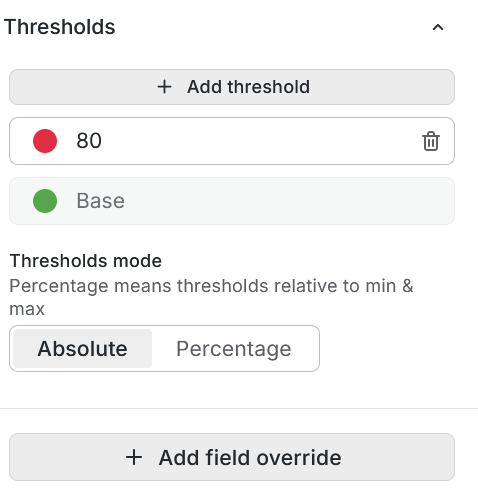

> **Why:** a default threshold of `80` makes no sense for an error-rate metric where *any* value above 0 indicates a real problem. Changed the red threshold to a small positive value (`0.001`) so exact `0` (healthy) stays green, and any real error rate immediately turns red.

### 6.6 Final result

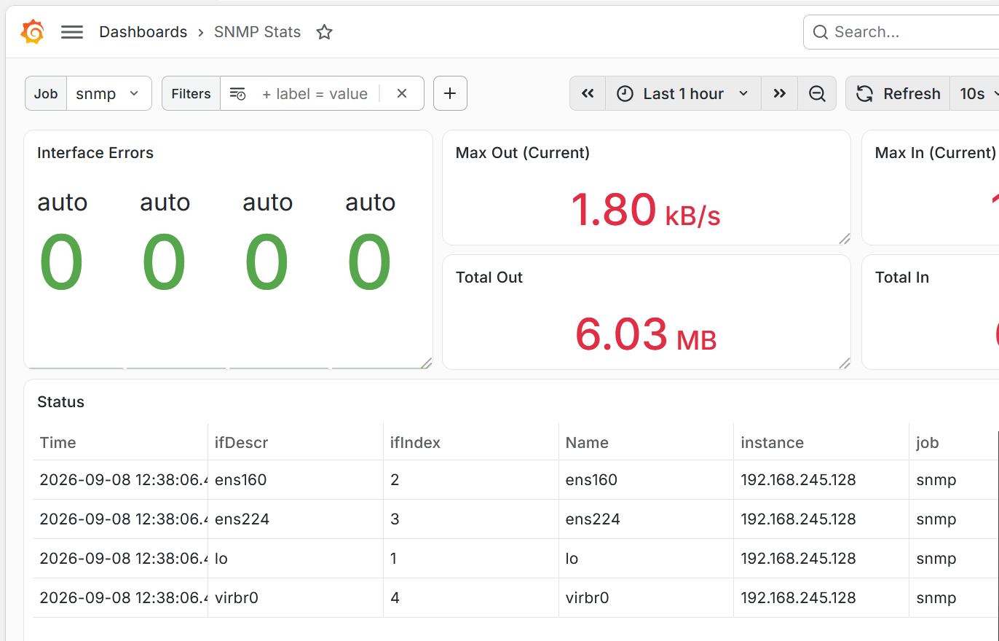

**Verify:** all four interfaces (`ens160`, `ens224`, `lo`, `virbr0`) show green `0` error panels alongside live traffic figures — the full SNMP monitoring chain is confirmed end-to-end.

---

## Appendix A — Full Issue Log

| Symptom | Cause | Fix |
|---|---|---|
| `snmpwalk` to `192.168.245.128` timed out after working on `127.0.0.1` | `rocommunity public 127.0.0.1` restricts allowed *source* address, not target | `sed -i 's/rocommunity public 127.0.0.1/rocommunity public default/' /etc/snmp/snmpd.conf && systemctl restart snmpd` |
| `curl .../-/reload` returned "Lifecycle API is not enabled" | Prometheus systemd service was missing `--web.enable-lifecycle` | Rewrote `prometheus.service` to add the flag (and drop obsolete `--web.console.*` flags); `systemctl daemon-reload && systemctl restart prometheus` |
| Grafana dashboard `13649` import: "Unknown error" | Old (2022) dashboard, not actually SNMP-specific by design, likely Angular-panel based — unsupported in Grafana 13.x | Used dashboard ID `23022` ("SNMP Stats") instead — modern panel types, imports cleanly |
| Uptime panel shows N/A | Panel queried `sysUpTime`, which the `if_mib` module does not collect | Removed the panel; replaced with a metric actually covered by `if_mib` (interface errors) |
| Thresholds section not visible under Unit options | Thresholds is a separate collapsible section, not nested inside Standard/Unit options | Use the search icon in the panel options pane and type `threshold` to jump directly to it |
| Default error threshold of `80` was meaningless for an error-rate metric | Grafana's default Stat panel threshold (80) is a generic placeholder, not tailored to the metric | Changed the red threshold to `0.001` so exactly `0` stays green and any real error immediately shows red |

## Appendix B — Screenshots Still Needed

The 20 screenshots above cover the full working path. These specific steps were done via terminal/pasted text rather than captured as /assets/xcat/snmp — grab these next time to make the guide fully screenshot-complete:

| Step | What to capture |
|---|---|
| `snmpd.conf` fix | Terminal showing the `sed` command changing `rocommunity public 127.0.0.1` to `rocommunity public default`, plus the successful `snmpwalk` retest against the real IP (`192.168.245.128`) right after |
| Corrected `prometheus.service` | `cat /etc/systemd/system/prometheus.service` showing the final version **without** `--web.console.templates`/`--web.console.libraries` and **with** `--web.enable-lifecycle` |
| Lifecycle reload working | Terminal showing `curl -X POST http://localhost:9090/-/reload` returning silently (success) instead of the earlier "Lifecycle API is not enabled" error |
| Prometheus target health check | Browser or `curl+jq` output of `http://localhost:9090/api/v1/targets` showing the `snmp` job with `"health": "up"` and empty `lastError`, for the real target IP (not `127.0.0.1`) |
| Grafana data source test | The Grafana Connections → Data sources → Prometheus screen showing the green "Data source is working" confirmation after Save & Test |
| Firewalld reverted | `systemctl status firewalld` showing `inactive (dead)` again, confirming the temporary troubleshooting change was undone and didn't stay enabled |
