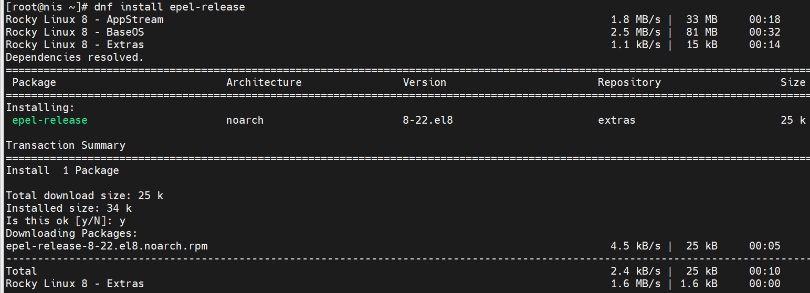
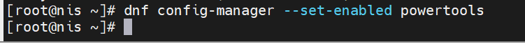
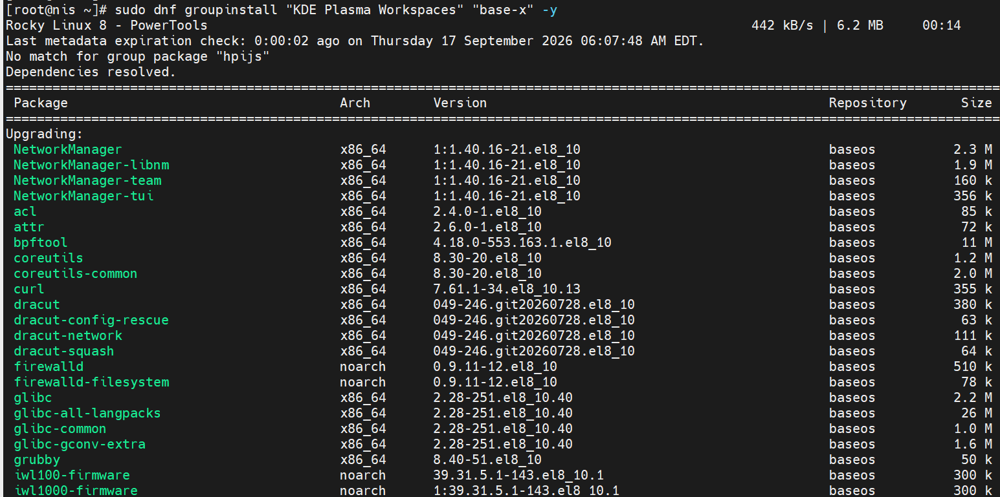
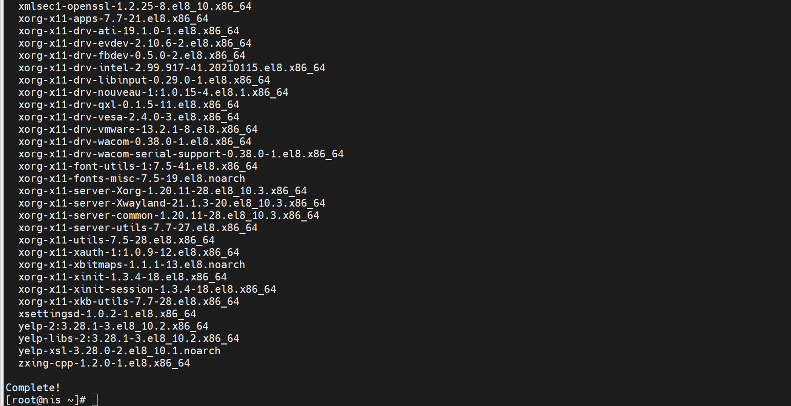
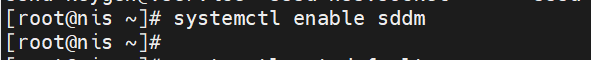
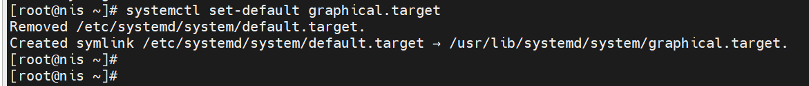
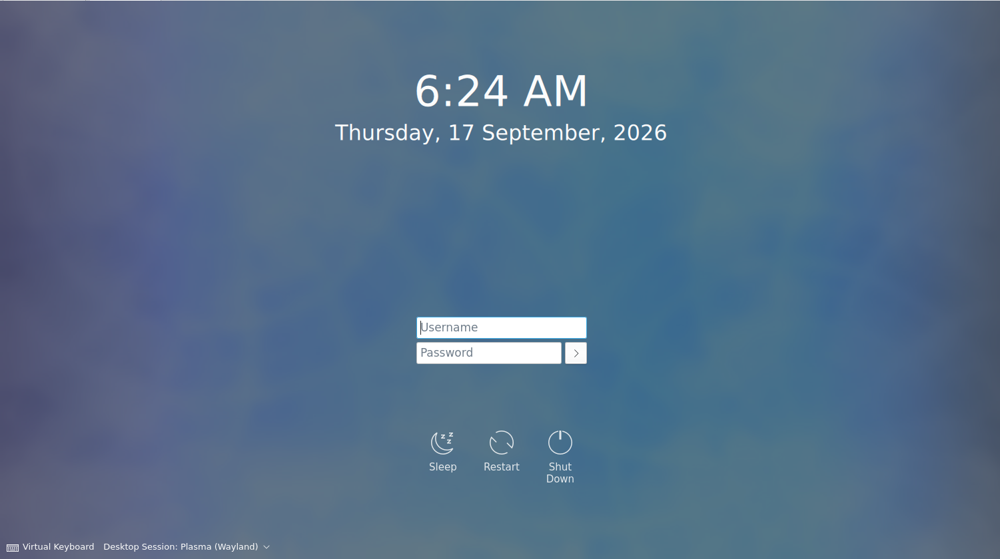
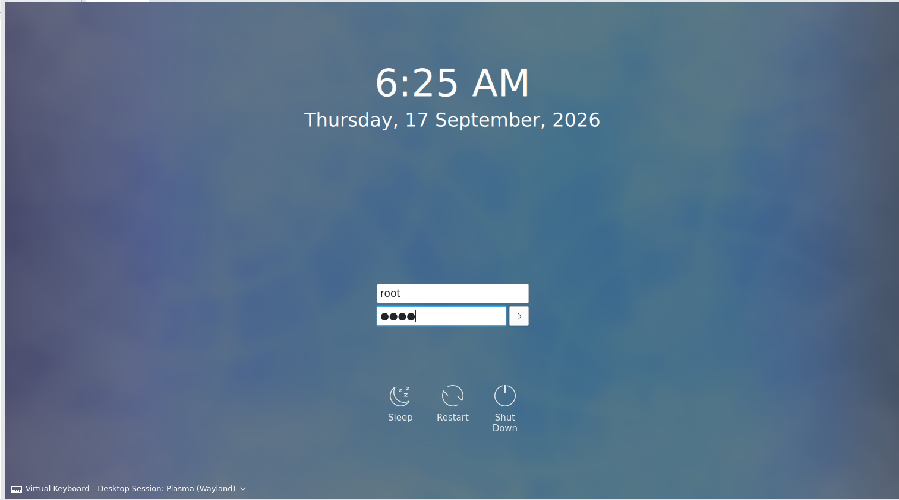
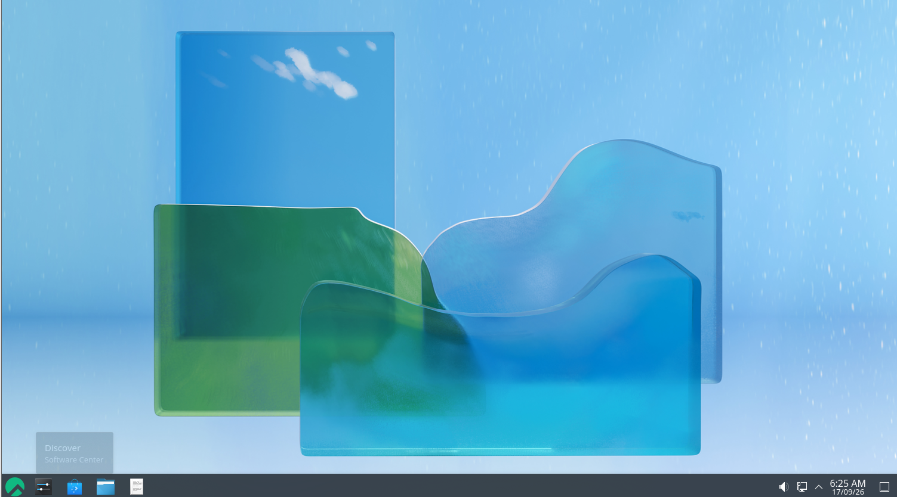
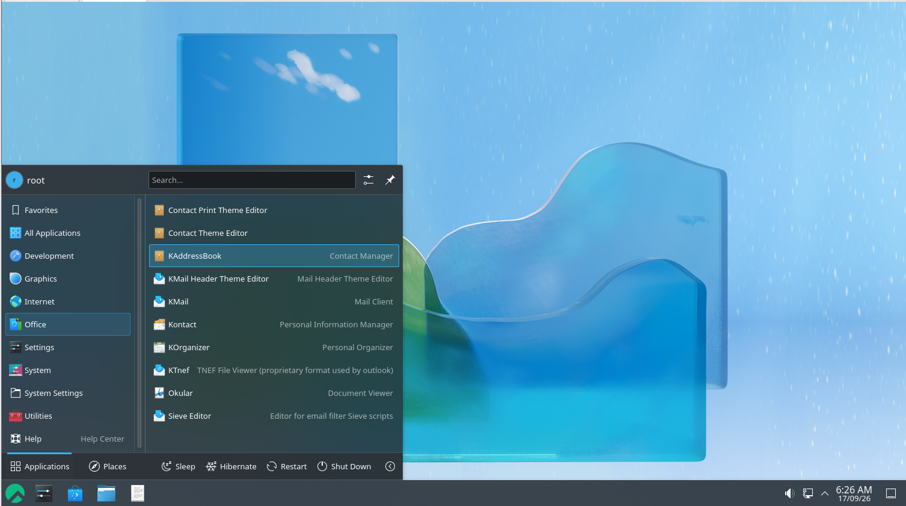

# KDE Plasma Workspaces Installation Guide

## Overview

This guide documents the complete installation process of KDE Plasma Workspaces and base-x graphics environment on Rocky Linux 8. The installation includes all necessary dependencies, display managers, and supporting applications.

## System Information

- **Operating System**: Rocky Linux 8 (Green Obsidian)
- **Release**: 8.10
- **Architecture**: x86_64
- **Environment**: Virtual machine (VMware)

## Installation Prerequisites

Before beginning the KDE Plasma installation, ensure your system meets the following requirements:

- Rocky Linux 8 with internet connectivity
- Sufficient disk space (minimum 3GB for Plasma components)
- Root or sudo access
- Active repository access (BaseOS, AppStream, Extras, PowerTools)

## Installation Steps

### Step 1: Install EPEL Release Repository

First, install the Extra Packages for Enterprise Linux (EPEL) repository to access additional packages:

```bash
dnf install epel-release
```

This installs version 8-22.el8 from the extras repository.

**Installation Log:**


### Step 2: Enable PowerTools Repository

The PowerTools repository provides additional build tools and development packages required for KDE Plasma:

```bash
dnf config-manager --set-enabled powertools
```

**Configuration Log:**


### Step 3: Install KDE Plasma Workspaces and Base-X

Install the complete KDE Plasma Workspaces environment along with base graphics packages:

```bash
sudo dnf groupinstall "KDE Plasma Workspaces" "base-x" -y
```

This command installs:
- **1025 new packages**
- **74 package upgrades**
- **Total download size**: ~2.0 GB

**Installation Progress:**


**Continuing Installation:**


### Step 4: Enable SDDM Display Manager

SDDM (Simple Desktop Display Manager) is the default display manager for KDE Plasma:

```bash
systemctl enable sddm
```

**SDDM Configuration:**


### Step 5: Set Graphical Target as Default

Configure the system to boot into graphical mode by default:

```bash
systemctl set-default graphical.target
```

**Target Configuration:**


## Login and Desktop Environment

### SDDM Login Screen

Once the installation is complete and the system has been rebooted, you'll see the SDDM login screen:

**SDDM Login Interface:**


### Authentication

Enter your credentials to log in. The example shows the root user logging in:

**Authentication Process:**


### KDE Plasma Desktop Environment

After successful authentication, the KDE Plasma desktop loads:

**Desktop Environment Loading:**


### KDE Applications Menu

The full KDE Plasma desktop is now available with access to all installed applications:

**Applications Menu:**


## Installed Components

The KDE Plasma Workspaces installation includes:

### Core Components
- KDE Plasma Desktop 5.24.7
- KWin Window Manager (X11 and Wayland support)
- SDDM Display Manager
- Plasma Workspace and utilities

### Applications
- Dolphin File Manager
- Kate Text Editor
- Konsole Terminal
- System Settings
- KAddressBook (Contacts)
- KMail (Email Client)
- KOrganizer (Calendar)
- Spectacle (Screenshot Tool)
- Okular (Document Viewer)
- GIMP-related tools

### System Tools
- NetworkManager and plugins
- Audio system (PulseAudio)
- Bluetooth support
- Printer management
- Font management utilities

### Graphics and Drivers
- Mesa drivers
- X.Org display server and drivers
- GTK themes and integration
- Icon themes (Breeze)

## Post-Installation Configuration

### 1. Update System
```bash
dnf update
```

### 2. Install Additional Applications (Optional)
```bash
dnf install firefox thunderbird vlc
```

### 3. Configure Network
Use the Network Manager applet in the system tray to configure your network connection.

### 4. Install Additional Languages (Optional)
```bash
dnf install ibus ibus-libpinyin
```

## Troubleshooting

### Display Issues
If the desktop doesn't display properly:
1. Check SDDM logs: `journalctl -u sddm -n 50`
2. Verify display drivers: `lspci | grep VGA`
3. Try setting environment variables: `export QT_QPA_PLATFORM=xcb`

### Performance Issues
If the system runs slowly:
1. Disable unnecessary visual effects in System Settings > Startup and Shutdown > Splash Screen
2. Check available disk space: `df -h`
3. Monitor system resources: Open System Monitor

### Audio Issues
If no sound is detected:
1. Install additional audio codecs: `dnf install gstreamer1-plugins-ugly`
2. Configure PulseAudio in System Settings > Multimedia
3. Check ALSA mixer levels: `alsamixer`

## Performance Optimization

### Disk Space
After installation, the system uses approximately 3-4 GB for KDE Plasma and all components.

### Memory
KDE Plasma typically uses 300-500 MB of RAM for basic operations.

### Boot Time
Expected boot time to desktop: 30-60 seconds (depending on system specifications)

## Updating KDE Plasma

To update KDE Plasma components:

```bash
dnf upgrade
```

## Additional Resources

- **Official KDE Project**: https://kde.org
- **Rocky Linux Documentation**: https://docs.rockylinux.org
- **KDE Community Support**: https://discuss.kde.org

## Conclusion

The KDE Plasma Workspaces installation is now complete. You have a fully functional desktop environment with all necessary tools for productivity and system management. The modular nature of KDE allows for further customization and extension based on your specific needs.

For additional support or customization options, consult the KDE documentation or the Rocky Linux community forums.

---

**Installation Completed**: September 17, 2026
**System Status**: Fully Operational
**Desktop Environment**: KDE Plasma 5.24.7
